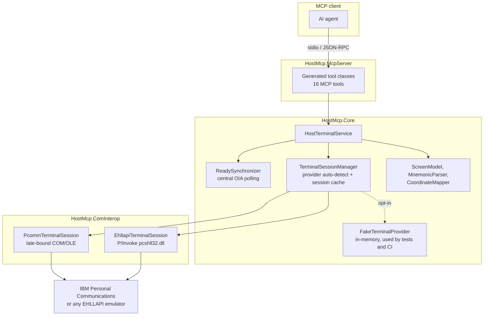

# mcp-server-host

An [MCP](https://modelcontextprotocol.io) server that drives **IBM 3270 and 5250 host terminal
emulators** from an AI agent — through the emulator's own COM/OLE automation interface (IBM
Personal Communications) or through the vendor-neutral **EHLLAPI** entry point.

The server does not talk TN3270/TN5250 itself. It attaches to the emulator you already have
installed and already use, so your existing SSL configuration, certificates, single sign-on and
session definitions keep working unchanged.

> **Status:** early scaffold. The abstraction, tool surface, synchronization and tests are
> complete and green; the PCOMM and EHLLAPI providers are written against the documented APIs but
> have not yet been verified against a live emulator. `transfer_file` is intentionally not
> implemented (see [docs/TOOLS.md](docs/TOOLS.md)).

---

## Why this is not just "send keys"

Automating a green screen is easy to get wrong in exactly one way: **timing**. After you press
Enter, the host takes an unknown amount of time to answer. The emulator signals this by inhibiting
the keyboard and setting the *X SYSTEM* / *X CLOCK* indicator in the Operator Information Area
(OIA). Reading the screen before that indicator clears gives you the *previous* screen.

This server solves that once, centrally, in `ReadySynchronizer`: every mutating operation polls the
OIA at a configurable interval until the keyboard lock clears or a timeout expires. Individual
tools never implement their own waiting, and `send_keys` returns the screen *after* the host
responded.

---

## Architecture



| Project | Target | Purpose |
| --- | --- | --- |
| `src/HostMcp.Core` | `net9.0` | `ITerminalSession` / `ITerminalProvider` abstraction, screen model, mnemonic parser, coordinate mapping, readiness synchronization, the tool service, and the in-memory fake provider. No COM, no P/Invoke. |
| `src/HostMcp.ComInterop` | `net9.0-windows` | The two real providers: PCOMM via late-bound COM, and generic EHLLAPI via `pcshll32.dll`. Plus the composition root. |
| `src/HostMcp.Generators.Mcp` | `netstandard2.0` | Roslyn source generator that turns `IHostTerminalService` into MCP tool classes, so the tool surface can never drift from the interface. |
| `src/HostMcp.McpServer` | `net9.0-windows` | The stdio MCP server executable. |
| `src/HostMcp.CLI` | `net9.0-windows` | `hostmcp` — a small CLI for probing providers and screens without an MCP client. |

The **single source of truth for the tool surface is `IHostTerminalService`**. Every method
becomes an MCP tool; `[Description]` attributes on methods and parameters become the schema the
model sees. A test asserts that the generated tool list matches the interface exactly.

---

## Supported emulators

| Emulator | Provider | Notes |
| --- | --- | --- |
| **IBM Personal Communications (PCOMM)** | `pcomm` (primary) | Full support via the `autECL*` COM automation objects. Richest surface: real field lists, OIA detail, session enumeration. |
| **IBM Personal Communications** | `ehllapi` (fallback) | Uses `pcshll32.dll`. Chosen automatically when the COM objects are not registered. |
| **Rocket (formerly Attachmate/Micro Focus) Reflection** | `ehllapi` | Ships an EHLLAPI-compatible DLL. Point the loader at it (see [docs/PLATFORM.md](docs/PLATFORM.md)). |
| **Rocket EXTRA! X-treme** | `ehllapi` | Same as above. |
| **Rocket BlueZone / BlueZone Web** | `ehllapi` | Desktop BlueZone exposes EHLLAPI; the browser edition does not. |
| **Any EHLLAPI-compliant emulator** | `ehllapi` | The provider only relies on the standard function numbers (Connect PS, Send Key, Copy PS, …). |
| _none installed_ | `fake` | An in-memory 24×80 screen for offline development, demos and the test suite. Opt-in only. |

Provider selection is `auto` by default: providers are probed in priority order (PCOMM, then
EHLLAPI) and the first available one wins. Set `HOSTMCP_PROVIDER` or pass `provider` to a tool to
force one. **If no emulator is installed the server still starts** — every tool then returns a
structured `no_provider` error explaining what is missing, instead of crashing.

---

## Tools

| Tool | What it does |
| --- | --- |
| `list_sessions` | Lists emulator sessions and their short names. Start here. |
| `connect_session` | Attaches to a session and keeps it open. |
| `disconnect_session` | Releases the session (does **not** log off the host). |
| `get_screen` | Full structured screen: dimensions, plain text, field list with position/length/`protected`/`numeric`/`hidden`, cursor, OIA status. |
| `read_field` / `write_field` | Field-addressed access, by field index or by any row/column inside the field. |
| `get_text` / `set_text` | Coordinate-addressed access, 1-based row/column like EHLLAPI. |
| `send_keys` | `USER01[tab]SECRET[enter]` — literal text mixed with mnemonics; waits for host readiness and returns the resulting screen. |
| `wait_for_ready` | Waits until the OIA keyboard lock clears. |
| `wait_for_text` | Waits for a text, anywhere or at an exact position, with timeout. |
| `search_text` | Searches the current screen without waiting. |
| `get_cursor` / `set_cursor` | Cursor position, 1-based. |
| `transfer_file` | IND$FILE send/receive. **Not implemented yet** — validates arguments and returns a structured error. |
| `batch` | Runs several steps in one round trip, with readiness waits between them. |

Full parameter reference: [docs/TOOLS.md](docs/TOOLS.md).

### Mnemonics

`[enter]` `[clear]` `[tab]` `[backtab]` `[home]` `[end]` `[delete]` `[backspace]` `[insert]`
`[eraseeof]` `[eraseinput]` `[reset]` `[attn]` `[sysreq]` `[test]` `[left]` `[right]` `[up]`
`[down]` `[pf1]`–`[pf24]` `[pa1]`–`[pa3]`. Write `[[` for a literal `[`.

---

## x86 vs x64 — read this before you file a bug

**PCOMM commonly registers its COM automation objects as 32-bit only, and `pcshll32.dll` is a
32-bit library.** A 64-bit process cannot load either. If auto-detection reports that the ProgID
is not registered or that the DLL cannot be loaded, you almost certainly need the **x86** build:

```powershell
dotnet publish src/HostMcp.McpServer -c Release -p:HostMcpPlatform=x86 -o out/x86
```

Use `-p:HostMcpPlatform=x64` for 64-bit installations. Both bitnesses are built in CI. The full
decision table is in [docs/PLATFORM.md](docs/PLATFORM.md).

---

## Getting started

### Install from NuGet

Both entry points ship as .NET tools (Windows, .NET 9 runtime required):

```powershell
# MCP server
dotnet tool install --global HostMcp.McpServer

# CLI
dotnet tool install --global HostMcp.CLI
```

`HostMcp.Core` and `HostMcp.ComInterop` are not published separately — both tool packages are
self-contained and already bundle them.

> Releases are cut from [`.github/workflows/release.yml`](.github/workflows/release.yml) and
> pushed to nuget.org through Trusted Publishing (OIDC), not a stored API key.

### Build from source

```powershell
git clone https://github.com/trsdn/mcp-server-host
cd mcp-server-host
dotnet build HostMcp.sln
dotnet test HostMcp.sln          # green without any emulator installed
```

Try it without a host, using the in-memory provider:

```powershell
$env:HOSTMCP_PROVIDER = "fake"
dotnet run --project src/HostMcp.CLI -- sessions
dotnet run --project src/HostMcp.CLI -- screen A
```

Register the MCP server with your client (see [.vscode/mcp.json](.vscode/mcp.json) for a working
example):

```json
{
  "servers": {
    "host": {
      "type": "stdio",
      "command": "path\\to\\HostMcp.McpServer.exe"
    }
  }
}
```

### Configuration

| Variable | Default | Meaning |
| --- | --- | --- |
| `HOSTMCP_PROVIDER` | `auto` | `auto`, `pcomm`, `ehllapi` or `fake`. |
| `HOSTMCP_READY_TIMEOUT_SECONDS` | `30` | Timeout for OIA readiness and text waits. |
| `HOSTMCP_POLL_INTERVAL_MS` | `100` | OIA polling interval. |
| `HOSTMCP_ROWS` / `HOSTMCP_COLUMNS` | `24` / `80` | Presentation space size assumed by the EHLLAPI provider (it cannot query it). |

---

## Security and compliance

Terminal automation reaches into systems of record. Treat it accordingly.

- **Mainframe access is auditable.** Every action this server performs is executed under the
  identity of the already-signed-on emulator session and will appear in RACF/ACF2/Top Secret and
  SMF records as that user. Get sign-off from the platform owner before pointing an agent at a
  production LPAR.
- **This repository is public. It contains no host names, no LU names, no session profiles, no
  user IDs and no credentials, and it must stay that way.** Keep `.ws` profiles, HOD/BlueZone
  configuration and connection details out of commits.
- **Never pass credentials through tool arguments you would not want logged.** MCP clients
  routinely log tool calls and their parameters. Prefer emulator-side single sign-on. Screen fields
  marked hidden are returned with empty text by `get_screen` for the same reason.
- **Prefer read-only exploration first.** `get_screen`, `search_text` and `get_text` do not change
  host state. `send_keys` does — including irreversible transactions. There is no undo on a
  mainframe.
- **Constrain the blast radius.** Run against a test region where possible, use a host user ID with
  the minimum required authority, and never run an agent unattended against production.

---

## Documentation

- [docs/TOOLS.md](docs/TOOLS.md) — every tool, its parameters and its result shape
- [docs/PLATFORM.md](docs/PLATFORM.md) — x86/x64, provider detection, emulator setup
- [docs/DEVELOPMENT.md](docs/DEVELOPMENT.md) — project layout, code generation, testing, conventions

## License

MIT — see [LICENSE](LICENSE).
