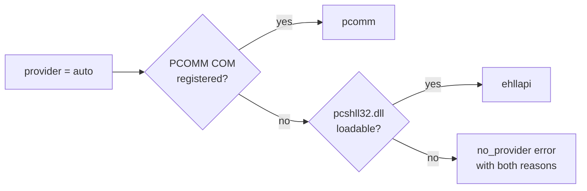

# Platform: x86, x64 and emulator detection

This server is **Windows-only**. It automates a locally installed terminal emulator through COM or
a native DLL; neither exists on Linux or macOS.

## The bitness problem

Two independent 32-bit constraints usually decide which build you need.

**1. COM registration (PCOMM provider).** A COM server registered as 32-bit (`InprocServer32`
under `HKCR\CLSID\...` in the `Wow6432Node` hive) cannot be activated in-process by a 64-bit
client. IBM Personal Communications historically registers its `autECL*` automation objects as
32-bit only. `CreateObject("PCOMM.autECLConnList")` from a 64-bit process then fails with
`REGDB_E_CLASSNOTREG` — even though PCOMM is installed and running.

**2. Native library bitness (EHLLAPI provider).** `pcshll32.dll` is a 32-bit DLL, as the `32` in
its name suggests. A 64-bit process cannot load it at all.

### Decision table

| Situation | Build |
| --- | --- |
| PCOMM installed, standard install | **x86** |
| PCOMM installed, you verified the 64-bit COM registration exists | x64 |
| EHLLAPI against `pcshll32.dll` | **x86** |
| EHLLAPI against a vendor 64-bit HLLAPI DLL | x64 |
| No emulator, `HOSTMCP_PROVIDER=fake` | either |

**When in doubt, use x86.** A 32-bit process can automate a 64-bit emulator's COM server
out-of-process, but the reverse in-process case is what fails.

### Building for a bitness

```powershell
# 32-bit (the usual choice)
dotnet publish src/HostMcp.McpServer -c Release -p:HostMcpPlatform=x86 -o out/x86
dotnet publish src/HostMcp.CLI       -c Release -p:HostMcpPlatform=x86 -o out/x86-cli

# 64-bit
dotnet publish src/HostMcp.McpServer -c Release -p:HostMcpPlatform=x64 -o out/x64
```

`HostMcpPlatform` is defined in `Directory.Build.props` and sets both `PlatformTarget` and
`RuntimeIdentifier` (`win-x86` / `win-x64`) for the whole solution. The Roslyn source generator is
deliberately excluded from it: analyzers are loaded into the 64-bit compiler process, so an x86
analyzer assembly would fail with `CS8034`.

Without the property the build is `AnyCPU` and runs 64-bit on a 64-bit OS — which is the right
default for CI and for the test suite, and usually the wrong one for talking to PCOMM.

## Provider detection



Detection is **side effect free until probed**: constructing the providers creates no COM object
and loads no DLL. That is what lets the MCP server start on a machine with no emulator installed.

Probing is done by:

- `pcomm`: `Type.GetTypeFromProgID("PCOMM.autECLConnList")` plus `Activator.CreateInstance`, caught
  and translated into a message that names the ProgID and the process bitness.
- `ehllapi`: `NativeLibrary.TryLoad("pcshll32.dll")`, translated the same way.

Force a provider with the environment variable or the per-tool `provider` argument:

```powershell
$env:HOSTMCP_PROVIDER = "pcomm"    # or ehllapi, fake, auto
```

## Emulator setup notes

### IBM Personal Communications

- The session must already be started and connected. This server attaches to a running emulator; it
  does not launch one.
- The session short name (`A`, `B`, …) is what `connect_session` expects. `list_sessions` reports
  the names PCOMM knows about.
- `pcshll32.dll` lives in the PCOMM installation directory. If it is not on `PATH`, add that
  directory or copy the DLL next to the executable.

### Rocket Reflection / EXTRA! X-treme

Both ship an EHLLAPI-compatible DLL under a vendor-specific name (for example `EHLAPI32.DLL`).
Place the appropriate DLL where the loader finds it under the name `pcshll32.dll`, or install the
vendor's PCOMM compatibility shim. The provider only calls standard EHLLAPI functions, so any
compliant implementation works.

### Rocket BlueZone

Desktop BlueZone exposes EHLLAPI and works with the `ehllapi` provider. **BlueZone Web** runs in a
browser sandbox and exposes no local automation surface — it is not supported.

### No emulator at all

```powershell
$env:HOSTMCP_PROVIDER = "fake"
```

registers an in-memory 24×80 presentation space with a handful of fields. Useful for developing
prompts, demoing the tool surface, and running the test suite. It is **opt-in only**, so
auto-detection never silently succeeds against a fake screen on a machine that should be talking to
a real host.

## EHLLAPI limitations

The EHLLAPI provider is a fallback and is genuinely less capable than PCOMM automation:

- **The presentation space size cannot be queried.** It is assumed to be 24×80; override with
  `HOSTMCP_ROWS` / `HOSTMCP_COLUMNS` for model 3/4/5 screens.
- **EHLLAPI is process-global.** Only one presentation space is connected at a time, so all calls
  are serialized through a semaphore and the target PS is re-connected before each operation.
- **Field attributes are inferred** from the attribute bytes in the copied presentation space
  rather than read from a field list object.
- **Some mnemonics have no EHLLAPI escape sequence** and raise a clear error telling you to use the
  PCOMM provider.
